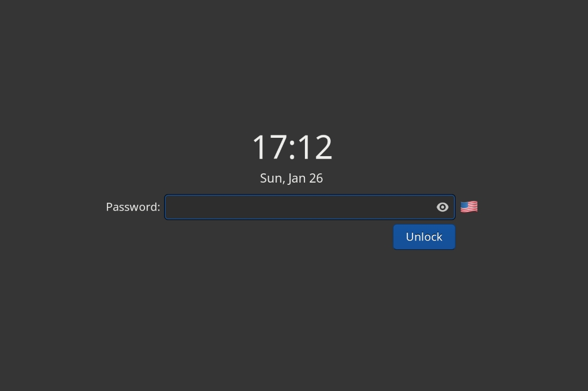

# gtklock-xkb-layout-module
[gtklock](https://github.com/jovanlanik/gtklock) module to display current keyboard layout on a lock-screen.
##

## About
[gtklock](https://github.com/jovanlanik/gtklock) module to display current keyboard layout on a lock-screen.

### config file
`formats=`array of pairs `layout=custom_text` separated by `;`

`font-size=`font size of label with current layout (default: inherit)

`width-chars=`width in chars of label (default: 2)

### config file examples
```
[xkb-layout]
formats=us=🇺🇸;ru=🇷🇺
font-size=16
width-chars=5
```
##
Based on code from Jovan Lanik's [gtklock-userinfo-module](https://github.com/jovanlanik/gtklock-userinfo-module).
The `gtklock-module.h` header can be used when making your own modules.

__⚠️ Module version matches the compatible gtklock version. Other versions might or might not work.__
## Dependencies
- GNU Make (build-time)
- pkg-config (build-time)
- gtk+3.0
- libxkbcommon
- libwayland-client

## Building
```bash
zig build
```
